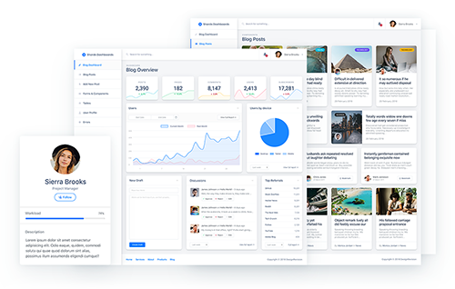

<p align="center">
<a href="https://designrevision.com/downloads/shards-dashboard-lite-react/">

</a>
</p>

<h1 align="center" style="border-bottom: none !important; margin-bottom: 5px !important;"><a href="https://designrevision.com/downloads/shards-dashboard-lite-react/">Shards Dashboard React</a></h1>
<p align="center">
  <a href="#">
    
  </a>
  <a href="https://twitter.com/designrevision">
    
  </a>
</p>

<p align="center">
A free React admin dashboard template pack featuring a modern design system <br />  and lots of custom templates and components.
</p>

<p align="center">
  <a href="https://designrevision.com/demo/shards-dashboard-lite-react">
    
  </a>
  <a href="https://designrevision.com/downloads/shards-dashboard-lite-react">
    
  </a>
</p>

<br />

<p align="center">
<a href="https://designrevision.com/downloads/shards-dashboard-lite-react">

</a>
</p>

<br />

> ✨ **Note:** You can download the Sketch files from the official product page.

<br />

### Quick Start

* Install dependencies by running `yarn` or `npm install`.
* Run `yarn start` or `npm run start` to start the local development server.
* 😎 **That's it!** You're ready to start building awesome dashboards.

<br />

### Project Structure


<br />

### Available Scripts

### `npm start`

Runs the app in the development mode.

### `npm test`

Launches the test runner in the interactive watch mode.

### `npm run build`

Builds the app for production to the `build` folder.

### `npm run eject`

**Note: this is a one-way operation. Once you `eject`, you can’t go back!**

If you aren’t satisfied with the build tool and configuration choices, you can `eject` at any time. This command will remove the single build dependency from your project.


<br />

### 🌟 Pro Version

If you're looking for something more, check out [Shards Dashboard Pro React](https://designrevision.com/downloads/shards-dashboard-pro-react/) which features many more custom templates and components. Use the `GITHUB15` coupon code for a **15% discount off the current price**.

<br />

### Built using


<br />

### Changelog

Please check out the [CHANGELOG](CHANGELOG.md).

## GrowingUp

A modern, feature-rich blogging and dashboard platform built with React. This project provides a customizable admin dashboard, blog management tools, and a variety of reusable UI components.

## Features

- **Blog Management**: Create, edit, and manage blog posts with a rich text editor.
- **Dashboard Analytics**: Visualize user activity, device usage, referrals, and more.
- **User Profiles**: View and manage user profiles with detailed analytics.
- **Reusable Components**: Includes forms, buttons, charts, tables, and more.
- **Responsive Design**: Optimized for desktop and mobile devices.
- **Customizable Layouts**: Easily modify navigation, sidebars, and page layouts.

## Project Structure

```
assets/               # Static images and assets
public/               # Public files (favicon, index.html, etc.)
src/                  # Main source code
  ├── App.js          # Main app component
  ├── components/     # Reusable UI components
  ├── flux/           # Flux architecture (actions, store, dispatcher)
  ├── layouts/        # Layout components
  ├── services/       # API and service logic
  ├── utils/          # Utility functions
  ├── views/          # Page views (Blog, Dashboard, etc.)
  └── ...
shards-dashboard/     # Shards Dashboard static HTML and assets
Dockerfile            # Docker configuration
package.json          # Project metadata and dependencies
README.md             # Project documentation
```

## Getting Started

### Prerequisites
- Node.js (v14 or higher recommended)
- npm or yarn

### Installation

1. Clone the repository:
  ```sh
  git clone https://github.com/taufiqelrahman/growingup.git
  cd growingup
  ```
2. Install dependencies:
  ```sh
  npm install
  # or
  yarn install
  ```

### Running the App

Start the development server:
```sh
npm start
# or
yarn start
```

The app will be available at `http://localhost:3000`.

### Docker
To run with Docker:
```sh
docker build -t growingup .
docker-compose up
```

## Folder Details
- **src/components/**: UI components grouped by feature (blog, common, forms, etc.)
- **src/views/**: Main pages (BlogOverview, AddNewPost, Users, etc.)
- **src/flux/**: State management using Flux pattern
- **src/services/**: API service logic
- **shards-dashboard/**: Static HTML dashboard templates and assets

## Customization
- Modify `src/config/sidebar-nav-items.js` to change sidebar navigation.
- Update `src/assets/` for custom images and styles.
- Extend components or views as needed for your use case.

## License
See `shards-dashboard/LICENSE` for dashboard template license. Project code is open for personal and educational use.

## Credits
- [Shards Dashboard](https://designrevision.com/docs/shards-dashboard/) for UI templates
- Built by Taufiq El Rahman
